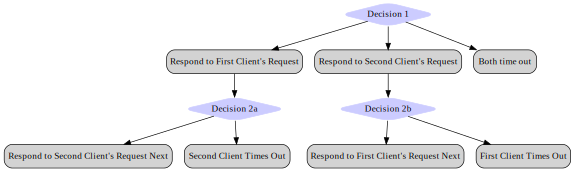

# Chapter 1: Getting Started

> **IMPORTANT**: Stateright is a relatively new framework and will be making breaking API
changes leading up to a 1.0 release, at which point the API will be considered
stable. If you plan to use Stateright for production scenarios, then please
[file a GitHub issue](https://github.com/stateright/stateright/issues/new) so
that the author can coordinate with you to minimize any disruption.

## Stateright's Value Proposition

Stateright is a Rust library that simplifies implementing distributed systems
while more importantly providing a powerful mechanism for verification.

Verification of distributed systems is difficult because distributed algorithms
must be resilient to nondeterminism caused by concurrency such as threads
racing, but that's only part of the challenge.  Distributed algorithms also
need to account for the fact that computers typically interface via [unreliable
networks](https://aphyr.com/posts/288-the-network-is-reliable) that will
periodically do things like reorder or lose messages (if you run your system in
"the cloud," then it's running on an unreliable network).  Furthermore, often a
distributed algorithm is expected to continue working even if a subset of
computers crash at arbitrary points in their execution.  Designing algorithms
that continue working in the presence of this added nondeterminism is
nontrivial and error prone, which necessitates special tools for verifying
correctness.

One approach to verifying the correctness of distributed algorithms is to run
them in an environment that randomly introduces nondeterminism more frequently
than a normal environment would. This is the approach taken by
[Jepsen](https://jepsen.io/analyses), and it has proven to be incredibly
effective, finding bugs in distributed systems such as
[etcd](https://jepsen.io/analyses/etcd-3.4.3),
[PostgreSQL](https://jepsen.io/analyses/postgresql-12.3),
[Redis](https://aphyr.com/posts/283-call-me-maybe-redis), and
[Zookeeper](https://aphyr.com/posts/291-call-me-maybe-zookeeper) among many
others.

Stateright's approach is similar, but rather than testing a random subset of
possible behaviors, it tests *all possible observable behaviors* within a
particular specification.  The catch is that Stateright needs to be embedded
into the system's implementation, whereas solutions such as Jepsen do not,
making them amenable to testing a wider range of software; but if you are
writing a distributed system in Rust, then Stateright can provide additional
verification over random testing.

## An Example

Let's start with a very simple distributed system: a
single client that can interact with a single server by
reading or writing a value. We'll see that even this
minimal example is susceptible to surprising behavior.

[Install the Rust programming
language](https://www.rust-lang.org/learn/get-started) if it is not already
installed, then initialize a new project using the `cargo` utility included
with Rust. If you are new to Rust, then you should also review some of the
language's [learning resources](https://www.rust-lang.org/learn).

```sh
mkdir getting-started
cd getting-started
cargo init
```

Define dependencies in `Cargo.toml`.

```toml
{{#include ../rs-src/getting-started/Cargo.toml}}
```

Here is the complete implementation for `main.rs`. Copy-paste it into your own
file. The subsequent sections will explain further.

```rust,ignore,noplayground
{{#include ../rs-src/getting-started/src/main.rs:all}}
```

## Actor Framework Intro

The code implements a simple server using the [actor
model](https://en.wikipedia.org/wiki/Actor_model)  in which an "actor" is an
object that can respond to events (such as timeouts or message receipt) and in
turn updates its internal state and generates outputs (such as sending a
message or setting a timer).

If you are familiar with the actor model (e.g. via the
[Erlang](https://www.erlang.org/) language or the [Akka](https://akka.io/)
library), then it is useful to note distinguishing characteristics of
Stateright's approach:

1. Stateright **must have visibility of every input and output** to facilitate
   simulating all possible system behaviors. That means inputs and outputs must
   be in the form of messages. For example, if your actor needs to interface
   with a database, you might introduce `DbExec(...)` output and
   `DbResult(...)` input messages; or if it needs to interface with the file
   system, you might introduce `FileRead(...)` output and `FileResult(...)`
   input messages. An adapter layer would then translate these into/from the
   corresponding effects rather than treating them as standard messages between
   actors in the system. This technique will be demonstrated in a later
   chapter.
2. Outputs **do not take effect until after the handler returns**. The outputs
   are simply collected in the [`o: &mut
   Out<Self>`](https://docs.rs/stateright/latest/stateright/actor/struct.Out.html)
   parameter whenever methods such as
   [`Out::send(...)`](https://docs.rs/stateright/latest/stateright/actor/struct.Out.html#method.send)
   are called, and Stateright's actor runtime sends them later.
3. The **actor state is only accessible via a clone-on-write cell** with the
   [`state: &mut
   Cow<Self::State>`](https://doc.rust-lang.org/std/borrow/enum.Cow.html)
   parameter. Doing so enables Stateright to more efficiently validate a system
   when it is enumerating different branches of nondeterministic behavior.

## Model Checking in More Detail

The reference to "enumerating different branches of nondeterministic behavior"
deserves additional explanation. The nondeterminism within a nondeterministic
system is never completely open ended. Instead there are "decision points" that
arise, where a "decision" isn't directly made by your code but rather is the
weighted random outcome of many factors. For example, if two clients
concurrently initiate requests to a service, then the initial "decision" would
be:

1. the first client's request is delivered causing the service to respond,
2. the second client's request is delivered causing the service to respond,
3. or both clients time out while contacting the service.

If option 1 occurs, then it can be followed by option 2, and vice versa. In
both cases, timeouts are also possible. In this manner the possible behaviors
of a nondeterministic system can be seen as a decision tree.



At each of these decision points, Stateright will explore one of the outcomes
and then backtrack to expore the other outcome. This is the distinguishing
characteristic of model checking in comparison with random testing. Also, each
gray box indicates a potential state of the aggregate system (where the
aggregate system state includes the client state, the service state, and the
network state), and the collection of all potential aggregate states is known
as the "state space."

## Implementation Walkthrough

The server responds to `Put` and `Get` messages based only on its own local
state, providing its clients with a simple form of distributed storage,
sometimes known as a [shared
register](https://en.wikipedia.org/wiki/Shared_register).  Responses are linked
to requests via a request ID chosen by the client.

```rust,ignore,noplayground
{{#include ../rs-src/getting-started/src/main.rs:actor}}
```

A test follows. The test checks the system for a property called
[linearizability](https://en.wikipedia.org/wiki/Linearizability), which loosely
speaking means that the visible behavior of the register emulated by the actor
system is identical to that of a register within a single-threaded system. In
the words of the individuals who coined the term:

> Linearizability provides the illusion that each operation applied by
concurrent processes takes effect instantaneously at some point between its
invocation and its response, implying that the meaning of a concurrent object’s
operations can be given by pre- and post-conditions.
> - Maurice Herlihy and Jeannette Wing, in [Linearizability: A Correctness
Condition for Concurrent
Objects](https://citeseerx.ist.psu.edu/viewdoc/summary?doi=10.1.1.142.5315)

An important aspect of linearizability is the notion of a "sequential
specification," which serves as a reference for correct behavior of the system.
In other words, the system *emulates* the sequential specification.
For instance, the sequential specification could indicate:

- the system behaves like a memory cell (i.e. register semantics),
- the system behaves like a queue,
- or the system behaves like a stack.

That means that when someone indicates that a system is linearizable, it is
important to keep in mind the question "linearizable with respect to *what*?"
In this chapter, the sequential specification is register semantics, provided
by Stateright, but later chapters will involve other sequential specifications.

The test leverages
[`RegisterTestSystem`](https://docs.rs/stateright/latest/stateright/actor/register/struct.RegisterTestSystem.html),
which is built into Stateright and defines a system whereby a specified number
of clients (only 1 in this case) write distinct values and independently read
values without coordinating with one another. Under the hood
`RegisterTestSystem` also leverages Stateright's built-in
[`LinearizabilityTester`](https://docs.rs/stateright/latest/stateright/semantics/struct.LinearizabilityTester.html).

```rust,ignore,noplayground
{{#include ../rs-src/getting-started/src/main.rs:test}}
```

Stateright is able to find a bug that arises even if there is only a single
client. The test indicates a sequence of steps that trigger the bug (AKA a
[`Path`](https://docs.rs/stateright/0.23.0/stateright/struct.Path.html)), but
in practice you would normally just call `checker.assert_properties()`, and
Stateright would fail the test while indicating steps that reproduce the bug
(although the specific example that it finds can vary).

The actor with `Id` 0 is the server while the actor with `Id` 1 is the client.
For brevity, the example shows actor inputs (`Deliver`) but not outputs.


1. The server receives a `Put` from the client with value `'A'`, which it
   acknowledges. The client receives the `PutOk` acknowledgement and in turn
   sends a second `Put` with a new value, `'Z'` (not shown yet since the test
   indicates message deliveries only, not message sends).
   ```
   Deliver { src: Id::from(1), dst: Id::from(0), msg: Put(1, 'A') },
   Deliver { src: Id::from(0), dst: Id::from(1), msg: PutOk(1) },
   ```
2. The server receives the second `Put`, which it acknowledges. The client
   receives the `PutOk` acknowledgement and in turn sends a `Get` request (not
   shown yet), expecting to read `'Z'`.
   ```
   Deliver { src: Id::from(1), dst: Id::from(0), msg: Put(2, 'Z') },
   Deliver { src: Id::from(0), dst: Id::from(1), msg: PutOk(2) },
   ```
3. The network redelivers the first write, inadvertently overwriting the second:
   ```
   Deliver { src: Id::from(1), dst: Id::from(0), msg: Put(1, 'A') },
   ```
4. The server receives the earlier `Get` request and replies with `'A'`. The
   client receives the unexpected value, which violates linearizability because
   from the perspective of the client, the system is not behaving as a
   single-threaded register.
   ```
   Deliver { src: Id::from(1), dst: Id::from(0), msg: Get(3) },
   Deliver { src: Id::from(0), dst: Id::from(1), msg: GetOk(3, 'A') },
   ```

The last bit of code defines the `main` method, which allows you to run the
actor on UDP port 3000, encoding messages with the JSON format.

```rust,ignore,noplayground
{{#include ../rs-src/getting-started/src/main.rs:main}}
```

## Running

Confirm the system behaves as expected by running the test, which should pass
because the test asserts that the bug exists. Include the `--release` flag so
that Rust fully optimizes the code even during testing, as Stateright tests are
computationally intensive and can be time consuming.

```sh
cargo test --release
```

Now run the actor on a UDP socket.

```sh
cargo run --release
```

If using a POSIX-oriented operating system,
[netcat](https://en.wikipedia.org/wiki/Netcat) can be used to interact with the
actor from a different terminal window. Actor responses are omitted from the
listing below for clarity, but you will see messages such as `{"PutOk":0}`
printed to STDOUT. Numbers in the messages are request IDs, the importance of
which will be more evident in the next chapter.

```sh
nc -u localhost 3000
{"Put":[0,"X"]}
{"Get":1}
{"Put":[2,"X"]}
{"Get":3}
```

## Exercise

Uncomment the `// TRY IT` line, then run the test again. It should fail
indicating a sequence of steps that would cause the linearizability expectation
to be violated, and these steps may differ from the example that we followed.
This exercise demonstrates how Stateright can detect flaws that would likely go
undetected when simply reviewing code.

## Summary

This chapter introduced one of the simplest possible distributed systems and
showed how Stateright can find a subtle bug. The next chapter [Taming the
Network](./taming-the-network.md) will address that bug.
