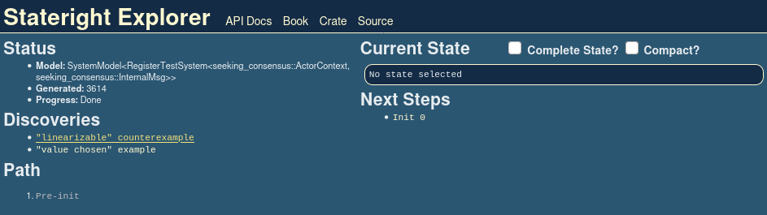
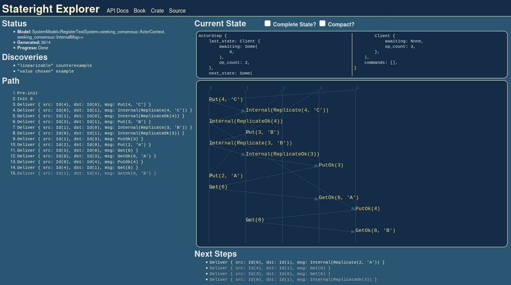
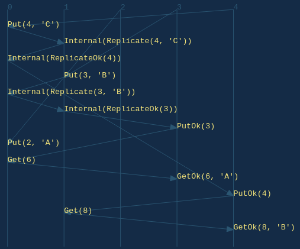

# Chapter 3: Seeking Consensus

In the last chapter we fixed a bug caused by the network's susceptibility to
message redelivery, but our solution could only run on a single server.
Introducing a second server would break linearizability as the system failed to
replicate information between servers.

In this chapter we introduce a simple replication protocol in an attempt to
address that shortcoming.

Once again, we start by initializing a new Rust project:

```sh
mkdir seeking-consensus
cd seeking-consensus
cargo init
```

Next we add dependencies to `Cargo.toml`. Notice that we now need to include
the `serde` package.

```toml
{{#include ../rs-src/seeking-consensus/Cargo.toml}}
```

By now you have the hang of implementing basic actor systems in Stateright, so
we'll defer the full `main.rs` source code listing until later in the chapter.

## A Replication Protocol

First we get to decide on a replication protocol. Give this some thought, and
see if you have ideas.

> **Exercise**: Yes, really. Take some time to think about how you might add
replication.

Done? Great!

For this example, we'll proceed with a protocol that simply involves forwarding
the value to every peer server before replying to the client, thereby ensuring
the servers agree on the value. This might be the protocol that you envisioned
as well.

## Implementation Walkthrough

The first notable difference is the need to introduce a message type for
replication.

```rust,ignore,noplayground
{{#include ../rs-src/seeking-consensus/src/main.rs:actor-msg}}
```

The server defers sending a `PutOk` message until replicas reply, but
Stateright actors are nonblocking, so they must manage some additional state:

- the ID of the request, against which replica replies are matched (to guard
  against late responses),
- the ID of the client that made the request (to facilitate replying later),
- and the set of servers that have acknowledged the replicated value (to
  facilitate waiting until all have replied).

```rust,ignore,noplayground
{{#include ../rs-src/seeking-consensus/src/main.rs:actor-state}}
```
We are now ready to implement the protocol.

```rust,ignore,noplayground
{{#include ../rs-src/seeking-consensus/src/main.rs:actor}}
```

Now the big question: does this protocol solve the problem we ran
into last chapter?

Unfortunately achieving linearizability involves a bit more sophistication, and
Stateright identifies a sequence of steps that are not linearizable. The
sequence is nontrivial and demonstrates why a model checker is so useful for
implementing distributed systems.

```rust,ignore,noplayground
{{#include ../rs-src/seeking-consensus/src/main.rs:test}}
```

## Stateright Explorer

It's not immediately clear why the sequence of steps identified by Stateright
violates linearizability. Luckily Stateright includes a web UI that can help
you understand scenarios such as this one.

Stateright Explorer is started by calling
[`serve(...)`](https://docs.rs/stateright/latest/stateright/struct.CheckerBuilder.html#method.serve).
You can easily do this by following the directions in the first `// TRY IT` line,
which will suspend the test when it is next run, allowing you to load
`http://localhost:3000` in your web browser to debug.

> **Tip**: Model checking with Stateright Explorer is breadth-first, as that
tends to find shorter discovery paths than depth-first search. One downside of
this approach is that breadth-first search consumes more memory, so Explorer
works best with relatively small state spaces (hundreds of thousands of states
rather than millions of states, for example).

When you load Stateright Explorer, you'll see the checker status in the upper
left corner. Within a few seconds the checker should add `"linearizable"
counterexample` to its list of discoveries.



Click that link to load the discovery.



The first thing you might notice is the
sequence diagram.



Tracing backwards from the last event, we can see why linearizability is
violated:

1. `GetOk(8, 'B')` indicates that `'B'` is the earliest write finishing before
   the read. Also, no operations are concurrent with the read.
2. `PutOk(4)` was in response to the long running `Put(4, 'C')` operation,
   indicating that the value `'C'` must have been written at some point between
   invocation and response. Unlike the read, the precise sequencing of this
   write in relation to other operations is indeterminate due to concurrency).
3. `GetOk(6, 'A')` indicates that `'A'` is the earliest write finishing before
   that read. Only the write of `'C'` is concurrent with the start and end of
   the read, so it's possible that the write took effect before or after the
   read took effect.

We don't have to trace any further back, as those observations above highlight
the anomaly: `'A'` had been the most recent write, then `'C'` may or may not
have been written next (as the concurrency allows different linearizations),
and finally `'B'` was read. No linearization of concurrent operations can
reconcile this anomaly, so the protocol is not linearizable. QED.

## Complete Implementation

Here is the complete implementation for `main.rs`:

```rust,ignore,noplayground
{{#include ../rs-src/seeking-consensus/src/main.rs:all}}
```

## Suggested Exercise

Uncomment the second `// TRY IT` line to cause the test to fail, delete the
linearizability counterexample assertion since it may not longer apply, and see
if you can amend the actor implementation to make the test pass. The next
chapter will provide a solution, but going through the exercise of trying to
design a solution youself will help convey how subtle bugs can be with
distributed protocols, and hopefully it will demonstrate why Stateright is so
useful for this problem space.

> **Reminder**: use `cargo test --release` when running the tests for
dramatically better model checking performance. Running tests without that flag
may result in significant delays. Also, try using [Stateright
Explorer](https://docs.rs/stateright/latest/stateright/struct.CheckerBuilder.html#method.serve)
for debugging as needed.

## Summary

This chapter introduced replication, and Stateright was able to find a bug in
our replication protocol. The next chapter will introduce a more sophisticated
protocol that makes the replicated register linearizable.

That next chapter is not yet available, so in the meantime you can learn more
about Stateright by browsing additional [Stateright
examples](https://github.com/stateright/stateright/tree/master/examples) and
reviewing the [Stateright API docs](https://docs.rs/stateright).

If you have any questions, comments, or ideas, please share them on
[Stateright's Discord server](https://discord.com/channels/781357978652901386).
At this time Stateright is a small personal project, and the main author is
eager to hear community feedback.
